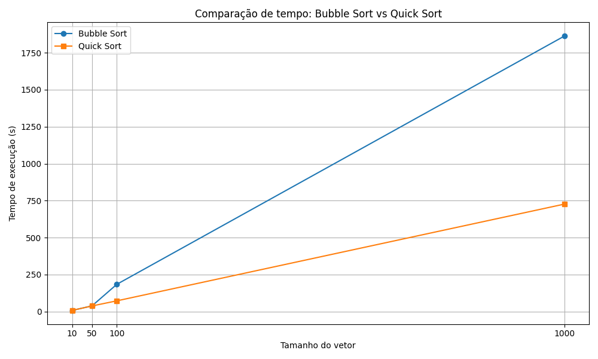

# Ordenação em Assembly MIPS

Este projeto implementa Bubble Sort e Quick Sort em Assembly MIPS, utilizando o simulador MARS. Os dados são lidos de arquivos de texto e o resultado ordenado é salvo no mesmo arquivo.

## Como usar
1. Gere arquivos de teste executando o script Python:
   ```bash
   python EP-OAC/EP-OAC/epOac/Arquivos_de_numero/geracao_numeros.py
   ```
2. No início do arquivo `ep.asm`, configure:
   - O caminho do arquivo de entrada:
     ```assembly
     arq_nome: .asciiz "CAMINHO/DO/ARQUIVO.txt"
     ```
   - O tipo de ordenação:
     ```assembly
     tipo_ord: .word 1  # 1 = Bubble Sort, 2 = Quick Sort
     ```
3. Abra o `ep.asm` no MARS e execute (Run). O arquivo será sobrescrito com os números ordenados.

## Estrutura
- `geracao_numeros.py`: Gera arquivos de números aleatórios.
- `ep.asm`: Código Assembly para ordenação.
- Arquivos `.txt`: Entradas de teste.

## Procedimentos do código Assembly

- **Abertura do arquivo**: Abre o arquivo de entrada definido em `arq_nome` para leitura dos números.

- **Contagem de linhas**: Lê o arquivo linha por linha para contar quantos números existem (cada linha = 1 número).

- **Alocação de memória**: Reserva espaço na memória para armazenar todos os números lidos do arquivo.

- **Leitura dos números**: Lê cada linha do arquivo, converte de string para float e armazena no array em memória.

- **Chamada da ordenação**: Chama a função de ordenação escolhida (Bubble Sort ou Quick Sort), de acordo com o valor em `tipo_ord`.

- **Impressão/Salvamento**: Abre o arquivo novamente, agora para escrita, e salva os números já ordenados, sobrescrevendo o arquivo original.

- **Finalização**: Fecha o arquivo e encerra o programa.

## Gráficos de Fluxo
### Bubble Sort


### Quick Sort


## Gráfico de Tempo de Execução


## Pontos de Melhoria
- **Evitar múltiplas leituras do arquivo**: Unificar a contagem de linhas e a leitura dos números em um único loop para reduzir I/O.

- **Otimizar Bubble Sort**: Implementar verificação de troca para parar o algoritmo caso o array já esteja ordenado antes do fim.

- **Otimizar Quick Sort**: Usar técnicas como escolha de pivô mais eficiente (mediana de três) e limitar recursão para subarrays pequenos.

- **Reduzir uso de syscalls**: Minimizar chamadas de sistema, principalmente para leitura e escrita, usando buffers maiores.

- **Evitar conversões desnecessárias**: Manter os dados em formato float durante todo o processamento, convertendo para string apenas na escrita final.

- **Comentar e modularizar mais**: Separar funções e adicionar comentários para facilitar futuras otimizações e manutenção.

- **Permitir escolher o arquivo e o modo de ordenação via entrada do usuário**, não só editando o código.

- **Implementar tratamento de erros** para arquivos inexistentes ou mal formatados.

- **Adicionar opção para salvar o resultado em um novo arquivo**, preservando o original.